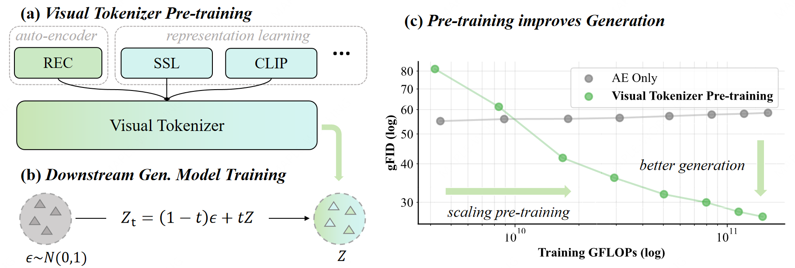
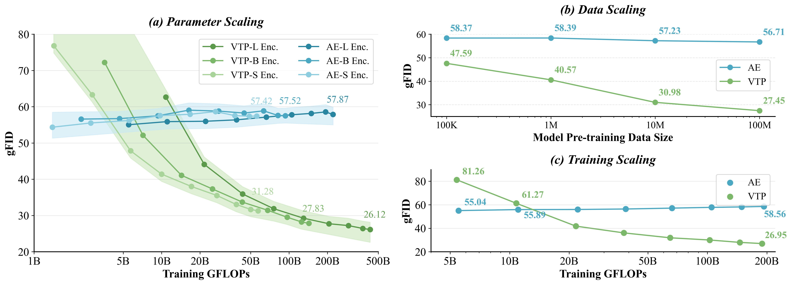
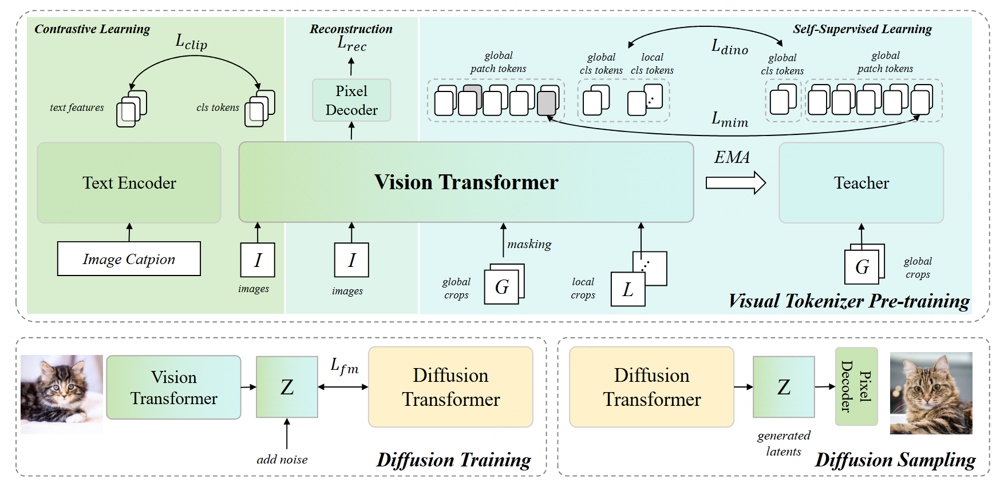

<div align="center">


<h2> Towards Scalable Pre-training of Visual Tokenizers for Generation </h2>

[Jingfeng Yao](https://github.com/JingfengYao)<sup>1</sup>, [Yuda Song](https://github.com/IDKiro)<sup>2</sup>, Yucong Zhou<sup>2</sup>, [Xinggang Wang](https://xwcv.github.io/)<sup>1,*</sup>

<sup>1</sup>Huazhong University of Science and Technology
<sup>2</sup>MiniMax  
<sup>*</sup>Corresponding author: xgwang@hust.edu.cn

***Work still in Progress.***


[](https://arxiv.org/abs/2512.13687)



</div>

## News

- **[2025.12.16]** We have released our [technical report](https://arxiv.org/abs/2512.13687) and [pretrained weights](#get-checkpoints).

## Takeaways


By integrating contrastive, self-supervised, and reconstruction learning, we have trained numerous visual tokenizers from scratch. We are seeking to unveil the novel scalability interlinking understanding, generation, and reconstruction.

- **Same FLOPs in DiT Training, VTP scaling helps better generation.**

- **Traditional auto-encoders CANNOT be scaled up for diffusion generative models.**

- **Understanding is the key driver for improving the learnability scaling.**

- **Parameter, data and training scalability can be seen while representation learning involved.** 

<div align="center">

</div>

## Get Checkpoints

| Checkpoints |
|-------|
| [](https://huggingface.co/MiniMaxAI/VTP-Small-f16d64) |
| [](https://huggingface.co/MiniMaxAI/VTP-Base-f16d64) |
| [](https://huggingface.co/MiniMaxAI/VTP-Large-f16d64) |

Weights will be released very soon.

<details>
<summary><b style="font-size: 1.1em;">🚀 Click Here to Quick Start </b></summary>

```
pip install -r requirements.txt
```

```python
import torch
from PIL import Image
from torchvision import transforms

from vtp.models.vtp_hf import VTPConfig, VTPModel
from vtp.tokenizers import get_tokenizer

model = VTPModel.from_pretrained("/path/to/MiniMaxAI/VTP-Large-f16d64")
model.eval()

# print model parameters
def count_params(m): return sum(p.numel() for p in m.parameters()) / 1e6
print(f"Vision Encoder: {count_params(model.trunk):.1f}M")
print(f"Pixel Decoder:  {count_params(model.pixel_decoder):.1f}M")
print(f"Text Encoder:   {count_params(model.text_transformer):.1f}M")

preprocess = transforms.Compose([
    transforms.Resize((256, 256)),
    transforms.ToTensor(),
    transforms.Normalize(mean=[0.485, 0.456, 0.406], std=[0.229, 0.224, 0.225])
])
image = preprocess(Image.open("figures/dog.png")).unsqueeze(0)

# ---------------------------------------------------------------------------------------
# use it as auto-encoder; rFID=0.36
# ---------------------------------------------------------------------------------------
denormalize = transforms.Normalize(
    mean=[-0.485/0.229, -0.456/0.224, -0.406/0.225],
    std=[1/0.229, 1/0.224, 1/0.225]
)
with torch.no_grad(), torch.autocast("cuda"):
    latents = model.get_reconstruction_latents(image)  # encode
    recon = model.get_latents_decoded_images(latents)  # decode
recon_image = denormalize(recon[0]).clamp(0, 1).permute(1, 2, 0).cpu().numpy()
Image.fromarray((recon_image * 255).astype("uint8")).save("output/reconstructed.png")


# ---------------------------------------------------------------------------------------
# use it as clip; zero-shot 78.2
# ---------------------------------------------------------------------------------------
tokenizer = get_tokenizer('ViT-B-32', context_length=model.config.text_context_length)
text = tokenizer(["a diagram", "a dog", "a cat", "a person"])
with torch.no_grad(), torch.autocast("cuda"):
    image_features = model.get_clip_image_feature(image, normalize=True)
    text_features = model.get_clip_text_feature(text, normalize=True)
    text_probs = (100.0 * image_features @ text_features.T).softmax(dim=-1)
print("Label probs:", [f"{p:.4f}" for p in text_probs[0].tolist()])

# ---------------------------------------------------------------------------------------
# use it as ssl feature extractor; linear probing 85.7
# ---------------------------------------------------------------------------------------
with torch.no_grad(), torch.autocast("cuda"):
    # get last layer features (cls token + patch tokens)
    features = model.get_last_layer_feature(image)
    cls_token = features['cls_token']      # (B, 1024)
    patch_tokens = features['patch_tokens']  # (B, 256, 1024) for 256x256 image

    # or get intermediate layer features for linear probing
    intermediate = model.get_intermediate_layers_feature(
        image, n=4, return_class_token=True
    )  # returns 4 x (patch_tokens, cls_token), each cls_token is (B, 1024)
    for i in range(1, 5):
        print('Last %d layers:' % i)
        print('Patch tokens shape:', intermediate[-i][0].shape)
        print('Cls token shape:', intermediate[-i][1].shape)
```

</details>

## Performance

<table>
  <tr>
    <th rowspan="2">Model</th>
    <th colspan="2" style="text-align: center;">Understanding</th>
    <th colspan="1" style="text-align: center;">Reconstruction</th>
    <th colspan="1" style="text-align: center;">Generation</th>
  </tr>
  <tr>
    <th style="text-align: center;">Zero-shot Acc.</th>
    <th style="text-align: center;">Linear Probing</th>
    <th style="text-align: center;">rFID</th>
    <th style="text-align: center;">LightningDiT-XL 80ep<br>nocfg FID-50K</th>
  </tr>
  <tr><td><a href="https://github.com/mlfoundations/open_clip">OpenCLIP</a></td><td style="text-align: center;">74.0</td><td style="text-align: center;">-</td><td style="text-align: center;">-</td><td style="text-align: center;">-</td></tr>
  <tr><td><a href="https://github.com/openai/CLIP">CLIP</a></td><td style="text-align: center;">75.5</td><td style="text-align: center;">-</td><td style="text-align: center;">-</td><td style="text-align: center;">-</td></tr>
  <tr><td><a href="https://github.com/google-research/big_vision">SigLIP</a></td><td style="text-align: center;"><strong>80.5</strong></td><td style="text-align: center;">-</td><td style="text-align: center;">-</td><td style="text-align: center;">-</td></tr>
  <tr><td><a href="https://github.com/facebookresearch/mae">MAE</a></td><td style="text-align: center;">-</td><td style="text-align: center;">85.9</td><td style="text-align: center;">-</td><td style="text-align: center;">-</td></tr>
  <tr><td><a href="https://github.com/facebookresearch/dinov2">DINOv2</a></td><td style="text-align: center;">-</td><td style="text-align: center;"><strong>86.7</strong></td><td style="text-align: center;">-</td><td style="text-align: center;">-</td></tr>
  <tr><td><a href="https://github.com/FoundationVision/UniTok">UniTok</a></td><td style="text-align: center;">70.8</td><td style="text-align: center;">-</td><td style="text-align: center;">0.41</td><td style="text-align: center;">-</td></tr>
  <tr><td><a href="https://github.com/mit-han-lab/vila-u">VILA-U</a></td><td style="text-align: center;">73.3</td><td style="text-align: center;">-</td><td style="text-align: center;">1.80</td><td style="text-align: center;">-</td></tr>
  <tr><td><a href="https://github.com/hustvl/LightningDiT">VA-VAE-f16d32</a></td><td style="text-align: center;">-</td><td style="text-align: center;">-</td><td style="text-align: center;">0.28</td><td style="text-align: center;">4.29</td></tr>
  <tr><td><a href="https://github.com/hustvl/LightningDiT">VA-VAE-f16d64</a></td><td style="text-align: center;">-</td><td style="text-align: center;">-</td><td style="text-align: center;"><strong>0.15</strong></td><td style="text-align: center;">-</td></tr>
  <tr><td><a href="https://github.com/bytetriper/RAE">RAE-f16d768</a></td><td style="text-align: center;">-</td><td style="text-align: center;">84.5</td><td style="text-align: center;">0.57</td><td style="text-align: center;">4.28</td></tr>
  <tr><td><b>VTP-S-f16d64 (ours)</b></td><td style="text-align: center;">66.7</td><td style="text-align: center;">77.5</td><td style="text-align: center;">0.98</td><td style="text-align: center;">5.46</td></tr>
  <tr><td><b>VTP-B-f16d64 (ours)</b></td><td style="text-align: center;">73.2</td><td style="text-align: center;">81.0</td><td style="text-align: center;">0.74</td><td style="text-align: center;">3.88</td></tr>
  <tr><td><b>VTP-L-f16d64 (ours)</b></td><td style="text-align: center;">78.2</td><td style="text-align: center;">85.7</td><td style="text-align: center;">0.36</td><td style="text-align: center;"><strong>2.81</strong></td></tr>
</table>


## Introduction

The quality of the latent space in visual tokenizers (e.g., VAEs) is crucial for modern generative models. However, the standard reconstruction-based training paradigm produces a latent space that is biased towards low-level information, leading to a foundation flaw: better pixel-level accuracy does not lead to higher-quality generation. 
This implies that pouring extensive compute into visual tokenizer pre-training translates poorly to improved performance in generation. 

We identify this as the **"pre-training scaling problem"** and suggest a necessary shift: to be effective for generation, a latent space must concisely represent high-level semantics. 
We present visual tokenizer pre-training, **VTP**, a unified visual tokenizer pre-training framework, pioneering the joint optimization of image-text contrastive, self-supervised, and reconstruction losses. Our large-scale study reveals two principal findings: (1) understanding is a key driver of generation, and (2) much better scaling properties, where generative performance scales effectively with compute, parameters, and data allocated to the pretraining of the visual tokenizer. After large-scale pre-training, our tokenizer delivers a competitive profile (78.2 zero-shot accuracy, 0.36 rFID) and 3× faster convergence on generation compared to advanced distillation methods. More importantly, it scales effectively: without modifying standard DiT training specs, solely investing more FLOPS in pretraining VTP achieves 65.8\% FID improvement in downstream generation, while conventional autoencoder stagnates very early at 1/10 FLOPS.

<div align="center">

</div>

## Evaluation

#### Installation

```bash
conda create -n vtp python=3.10
conda activate vtp
git submodule update --init --recursive
pip install -r requirements.txt
```

#### Zero-shot Classification

Modify the corresponding paths in ``scripts/test_zero_shot_hf.sh``. Run:
```
bash scripts/test_zero_shot_hf.sh 
```

#### Linear Probing Classification

Modify the corresponding paths in ``scripts/test_linear_probing_hf.sh``. Run:
```
bash scripts/test_linear_probing_hf.sh
```

#### ImageNet Reconstruction

Modify the corresponding paths in ``scripts/test_reconstruction_hf.sh``. Run:
```
bash scripts/test_reconstruction_hf.sh
```

#### ImageNet Generation

We use [LightningDiT](https://github.com/hustvl/LightningDiT) codes to evaluate our generation performance.

Feature extraction:
```
bash generation/scripts/extract_features_vtp.sh generation/configs/train_vtp_l_dit_xl.yaml
```

LightningDiT training:
```
bash generation/scripts/train_lightningdit_vtp.sh generation/configs/train_vtp_l_dit_xl.yaml
```


LightningDiT sampling:
```
bash generation/scripts/inference_lightningdit_vtp.sh generation/configs/train_vtp_l_dit_xl.yaml
```

## Acknowledgements

Our pre-training codes are built upon [OpenCLIP](https://github.com/mlfoundations/open_clip) and [DINOv2](https://github.com/facebookresearch/dinov2). Our final model variant uses [DINOv3](https://github.com/facebookresearch/dinov3) architecture. 

We use [LightningDiT](https://github.com/hustvl/LightningDiT) for generation evaluation. 

Thanks for their great codes.

## Citation

```bibtex
@article{vtp,
  title={Towards Scalable Pre-training of Visual Tokenizers for Generation},
  author={Yao, Jingfeng and Song, Yuda and Zhou, Yucong and Wang, Xinggang},
  journal={arXiv preprint arXiv:2512.13687},
  year={2025}
}
```

## Contact Us

Contact us at model@minimax.io.